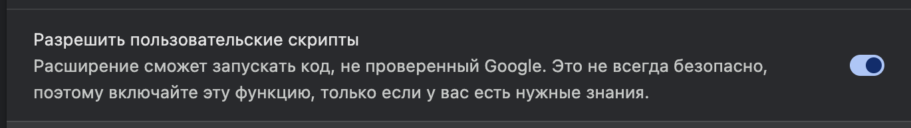
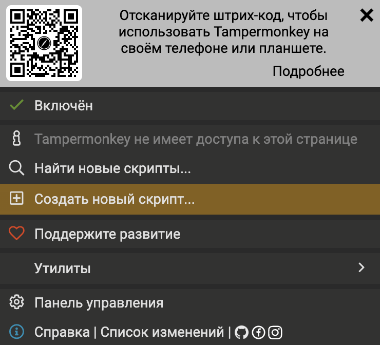

# Модуль 33: Перехват API-ответов в браузере

## Цель модуля

В этом модуле мы научимся внедрять свой JavaScript-код на веб-страницы. Это базовый навык для фронтенд-разработчика: понимание того, как браузер выполняет скрипты, как устроены запросы к серверу и почему нельзя доверять клиентскому коду.

Мы будем перехватывать `fetch`-запросы, модифицировать ответы API и наблюдать, как это влияет на отображение страницы. В конце — убедимся, что такие изменения работают только визуально и не дают реальных прав на сервере.

---

## Как читать этот файл

Этот файл написан в формате **Markdown**. Чтобы читать его с форматированием, нажми `Cmd+Shift+V` (Mac) или `Ctrl+Shift+V` (Windows/Linux) — откроется предпросмотр.

Или нажми иконку в правом верхнем углу редактора: **Open Preview to the Side**.

---

## Что за сайт

Работать будем с [snips.vuetifyjs.com](https://snips.vuetifyjs.com) — это сервис готовых UI-сниппетов для фреймворка Vuetify. На сайте есть авторизация через GitHub: после входа пользователь получает профиль с ролью, настройками и привязанными аккаунтами.

При загрузке страницы приложение отправляет запрос `GET /auth/verify`, чтобы проверить, авторизован ли пользователь. Сервер возвращает JSON с данными профиля, включая поля `isAdmin` и `role`. Именно этот ответ мы будем перехватывать и модифицировать.

---

## Шаг 1: Установка cookie

Перед тем как перехватывать ответ, нужно убедиться, что запрос на `/auth/verify` вообще отправляется.

Приложение экономит трафик: перед запросом оно проверяет наличие cookie `sx=1`. Если cookie нет — приложение считает, что пользователь не залогинен, и **не отправляет запрос** вовсе.

```javascript
// Вот что происходит внутри приложения (упрощённо):
if (!document.cookie.includes("sx=1")) {
    user.value = null;  // не залогинен, запрос не нужен
    return;
}
// Только если cookie есть — отправляем запрос
fetch("/auth/verify", { credentials: "include" });
```

Поэтому первый шаг — установить эту cookie.

Открой DevTools (`F12`) → вкладка **Console** и выполни:

```javascript
document.cookie = "sx=1; path=/";
```

После этого обнови страницу (`F5`). Теперь во вкладке **Network** ты увидишь запрос на `/auth/verify`.

> Если ты авторизован на сайте через GitHub — cookie уже установлена и запрос уходит автоматически. Этот шаг нужен только если ты не залогинен.

---

## Шаг 2: Установка Tampermonkey

### Что это такое

**Tampermonkey** — расширение для браузера, которое позволяет запускать свои скрипты на любых сайтах. Ты указываешь, на каком сайте и в какой момент выполнить код — расширение делает это автоматически при каждом посещении.

Зачем это нужно, если есть консоль? Консоль выполняет код **после** загрузки страницы, когда приложение уже запустилось и отправило все запросы. А нам нужно подменить `fetch` **до** того, как приложение его вызовет. Tampermonkey умеет запускать скрипт в момент `document-start` — ещё до выполнения любого JavaScript на странице.

### Установка

1. Открой магазин расширений:
   - **Chrome**: [Tampermonkey в Chrome Web Store](https://chrome.google.com/webstore/detail/tampermonkey/dhdgffkkebhmkfjojejmpbldmpobfkfo)
   - **Firefox**: [Tampermonkey в Firefox Add-ons](https://addons.mozilla.org/en-US/firefox/addon/tampermonkey/)
2. Нажми **Установить** / **Add to Chrome**
3. В панели браузера появится иконка Tampermonkey

### Включение режима разработчика (Chrome)

Tampermonkey требует режим разработчика для полноценной работы. Без него скрипты могут не запускаться.

1. Открой `chrome://extensions` в адресной строке
2. В правом верхнем углу включи переключатель **Developer mode** (Режим разработчика)


3. Найди **Tampermonkey** в списке расширений → нажми **Details** (Подробнее)
4. Убедись, что включено **Allow access to file URLs** (Разрешить доступ к URL файлов) — пригодится для локальной разработки



### Создание скрипта

1. Нажми на иконку Tampermonkey в панели браузера → **Create a new script**



2. Откроется редактор с шаблоном — удали всё и вставь свой код
3. Сохрани: `Ctrl+S` (Mac: `Cmd+S`)
4. Обнови страницу сайта — скрипт выполнится автоматически

---

## Шаг 3: Структура Tampermonkey-скрипта

Каждый скрипт начинается с блока метаданных — специальных комментариев, которые говорят Tampermonkey **где**, **когда** и **как** запускать код.

```javascript
// ==UserScript==
// @name         Verify Interceptor
// @match        https://snips.vuetifyjs.com/*
// @run-at       document-start
// @grant        none
// ==/UserScript==

// Здесь будет наш код
```

Разберём каждую строку:

### `@name`

Просто название скрипта. Отображается в списке скриптов Tampermonkey. Можно написать что угодно.

### `@match`

На каких сайтах запускать скрипт. `*` в конце означает «любая страница на этом домене».

```
@match  https://snips.vuetifyjs.com/*    — только snips.vuetifyjs.com
@match  https://*.vuetifyjs.com/*        — любой поддомен vuetifyjs.com
@match  *://*/*                          — вообще все сайты (не делай так)
```

### `@run-at document-start`

**Самая важная строка.** Определяет момент запуска:

| Значение | Когда запускается | Подходит нам? |
|----------|------------------|---------------|
| `document-start` | До загрузки любого JS на странице | Да |
| `document-end` | После загрузки DOM, но до картинок | Нет — fetch уже вызван |
| `document-idle` | После полной загрузки (по умолчанию) | Нет — слишком поздно |

Нам нужен `document-start`, потому что приложение вызывает `fetch("/auth/verify")` при инициализации. Если наш скрипт запустится позже — запрос уже уйдёт с оригинальным `fetch` и мы его не перехватим.

### `@grant none`

Отключает песочницу Tampermonkey. Без этой строки скрипт работает в изолированном контексте, где `window` — это **не тот же объект**, что у страницы.

```javascript
// Без @grant none:
window.fetch = myFetch;  // меняет fetch только в песочнице
                         // страница продолжает использовать свой fetch

// С @grant none:
window.fetch = myFetch;  // меняет fetch на странице
                         // приложение теперь вызывает наш myFetch
```

Если `alert("test")` работает, а подмена `fetch` — нет, скорее всего забыл `@grant none`.

---

## Шаг 4: Написание перехватчика

Теперь напишем код, который подменяет `fetch` и модифицирует ответ `/auth/verify`. Будем делать это по частям.

### 4.1. Сохрани оригинальный fetch

Создай новый скрипт в Tampermonkey. После блока метаданных первым делом сохрани ссылку на оригинальный `window.fetch` в переменную. Если этого не сделать, после подмены мы потеряем возможность делать настоящие запросы — функция будет вызывать сама себя бесконечно.

> `const` — [Модуль 1](../module-01/README.md).

### 4.2. Подмени window.fetch

Присвой `window.fetch` новую `async` стрелочную функцию. Она должна принимать все аргументы через rest-оператор (`...args`), чтобы потом передать их в оригинальный fetch.

> Стрелочные функции — [Модуль 5](../module-05/README.md). Rest-оператор (`...`) — [Модуль 9](../module-09/README.md). `async/await` — [Модуль 16](../module-16/README.md).

### 4.3. Вызови оригинальный fetch

Внутри новой функции вызови сохранённый оригинальный fetch, передав ему все аргументы через spread-оператор. Дождись ответа через `await`.

> Spread-оператор — [Модуль 9](../module-09/README.md). Fetch API — [Модуль 21](../module-21/README.md).

### 4.4. Отфильтруй по URL

Первый элемент `args` — это URL запроса (строка). Проверь: если URL **не содержит** `/auth/verify` — верни оригинальный ответ без изменений. Это важно — без фильтрации сломаются все остальные запросы на странице.

> Метод `includes` — [Модуль 1](../module-01/README.md). Условия — [Модуль 2](../module-02/README.md).

### 4.5. Прочитай и измени JSON

Если мы дошли сюда — это нужный запрос. Прочитай тело ответа через `response.json()` (не забудь `await`).

Ответ сервера выглядит так:

```json
{
  "user": {
    "id": "f7deaf34-...",
    "isAdmin": false,
    "role": "user",
    "name": "John Doe",
    "picture": "https://avatars.example.com/...",
    "identities": [{ "provider": "github", "emails": ["john@example.com"] }],
    ...
  },
  "access": []
}
```

Замени объект `user` новым объектом с нужными полями:

```javascript
data.user = {};
data.user.isAdmin = true;
data.user.role = "admin";
data.user.name = "Anonymous User";
```

> Объекты — [Модуль 7](../module-07/README.md). `response.json()` — [Модуль 21](../module-21/README.md).

### 4.6. Верни новый Response

Создай и верни `new Response()`. Первый аргумент — `JSON.stringify(data)`. Второй — объект с `status`, `statusText` и `headers` из оригинального ответа, чтобы приложение не заметило подмену.

> `JSON.stringify` — [Модуль 7](../module-07/README.md). HTTP-статусы — [Модуль 21](../module-21/README.md).

### 4.7. Проверь

Сохрани скрипт (`Ctrl+S`), обнови страницу (`F5`). Если всё правильно — на сайте отобразится «Anonymous User» с ролью admin.
